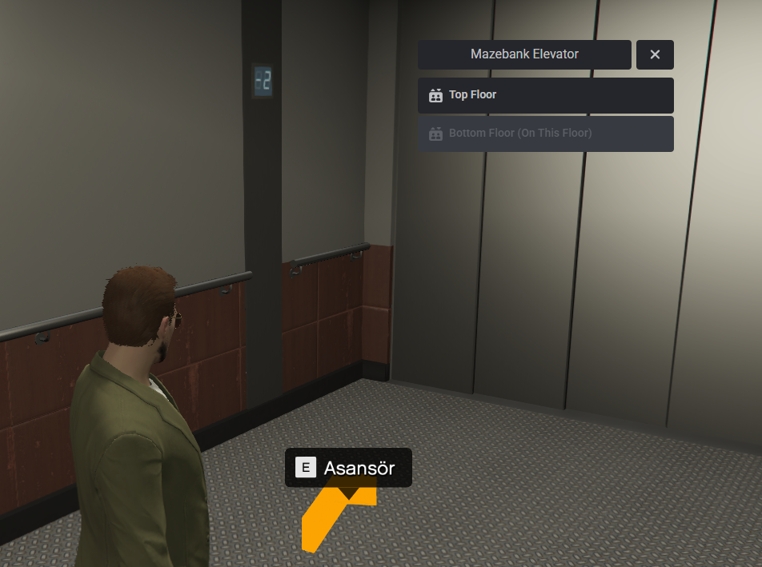

# t1-lift
t1-lift is a script that allows you to create multiple elevators with multiple floors, be they public or private.

# Dependency
* [QBCore](https://github.com/qbcore-framework/qb-core)
* [ox_lib](https://github.com/overextended/ox_lib/releases)

# Optional Dependency
* [interact-sound](https://github.com/qbcore-framework/interact-sound)

# Features
* Create multiple elevators with multiple floors
* Create restricted floors with one or multiple jobs or gangs
* Use your custom sounds in your lifts (Need interact-sound)

# Preview

# Credits
https://github.com/DanielCoelh0/qb-lift
